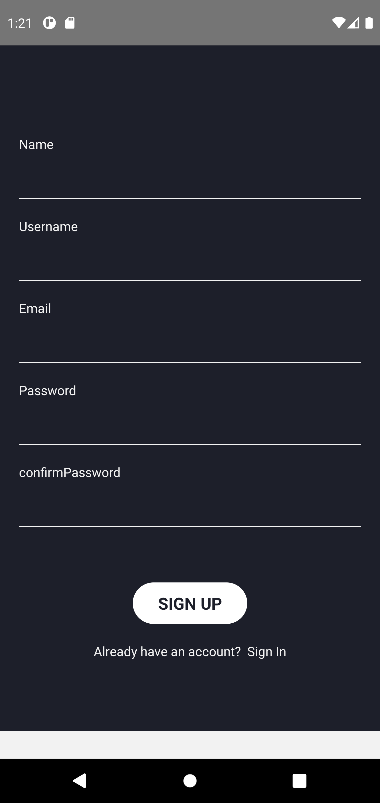
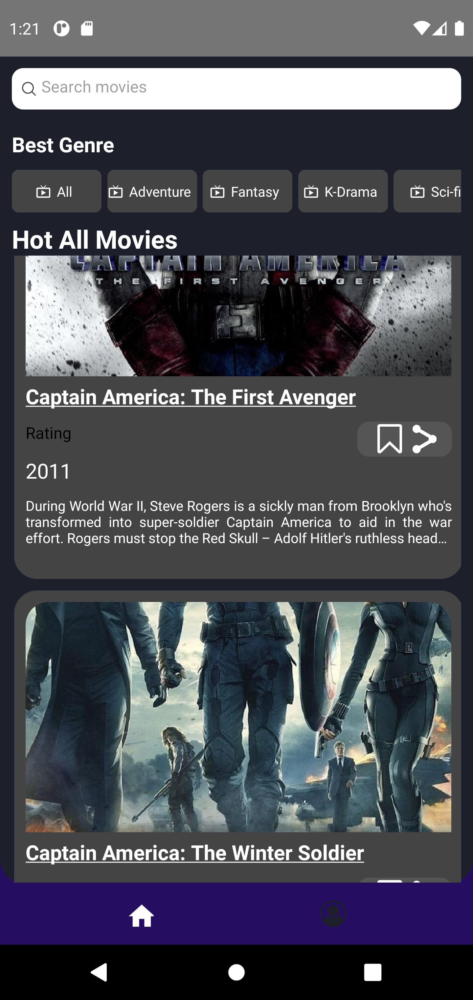
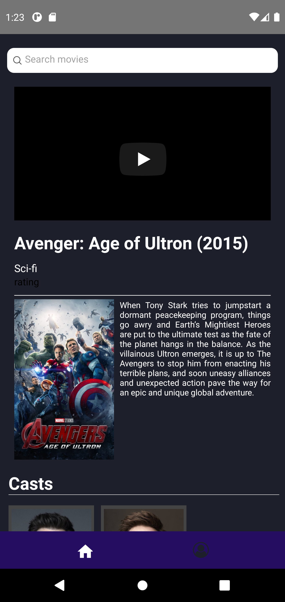

<h1 align="center">Movee</h1>
<p align="center">
  
</p>
<p align="center">
  Built with React Native
</p>


## Table of Contents

- [Introduction](#introduction)
- [Features](#features)
- [Requirements](#requirements)
- [Usage](#usage-for-development)
- [User Login](#user-login)
- [Screenshots](#screenshots)
- [Contact](#contact)
- [Contributors](#contributors)

## Introduction

<b>Movee</b> its an application for movies list.

## Features

- Users must sign in to use this application
- Able to create, edit and delete review
- And others

## Requirements

- [`npm`](https://www.npmjs.com/get-npm)
- [`react-native`](https://facebook.github.io/react-native/docs/getting-started)
- [`react-native-cli`](https://facebook.github.io/react-native/docs/getting-started)

## Usage for development

1. Open your terminal or command prompt
2. Type `git clone https://github.com/Ethutami/Movee.git`
3. Open the folder and type `npm install` for install dependencies
4. Type `npx react-native run-android` for run this app. **_Make sure your device is connected with debugging mode_**.
5. Login with the user below to enter the application.

## User Login

```
username: yayalala@gmail.com
password: Tami123_
```


## Screenshots

<div align="center">
       
    
</div>
<div align="center">
    
       
    
</div>


## Contact

If you want to contact me you can reach me at <ethutami@gmail.com>.

Copyright © 2021 by Ethutami

## Contributors

<center>
  <table>
    <tr>
      <td align="center">
        <a href="https://github.com/Ethutami">
          <br/>
          <sub><b>Ethutami</b></sub>
        </a>
      </td>
    </tr>
  </table>
</center>
